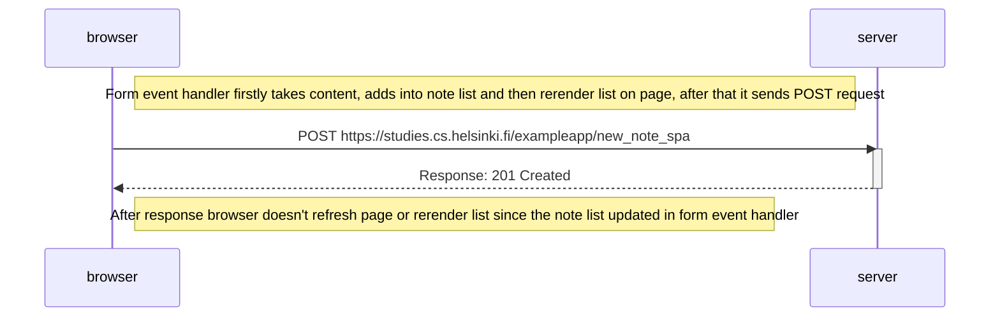

```mermaid
    sequenceDiagram
        participant browser
        participant server

        Note right of browser: Form event handler firstly takes content, adds into note list and then rerender list on page, after that it sends POST request

        browser->>server: POST https://studies.cs.helsinki.fi/exampleapp/new_note_spa
        activate server
        server-->>browser: Response: 201 Created
        deactivate server

        Note right of browser: After response browser doesn't refresh page or rerender list since the note list updated in form event handler
  
```